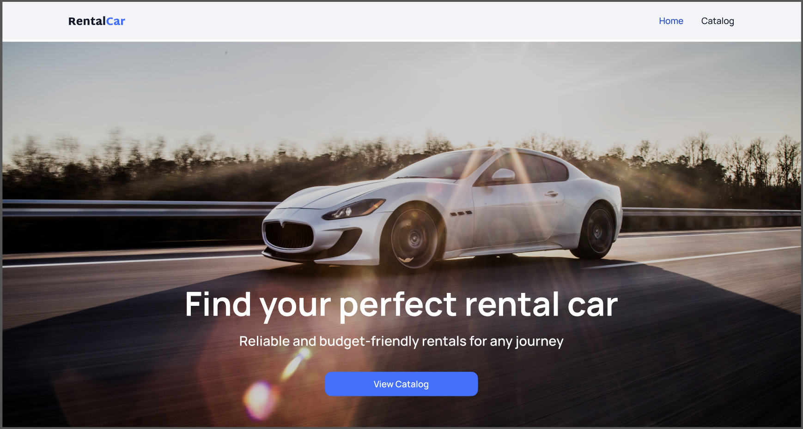

  <h1 id="top" style="font-size: 36px;"> RentalCar — Car Rental Web Application</h1>

  

    Next.js & TypeScript application for effortless car browsing and booking.
  

  

  

  

    <a href="#overview">Project Overview</a> • 
    <a href="#features">Features</a> • 
    <a href="#tech-stack">Tech Stack</a> • 
    <a href="#pages">Pages Structure</a> • 
    <a href="#api">API</a> • 
    <a href="#setup">Installation</a> • 
    <a href="#author">Author</a>
  

  

  <h2 id="overview">📋 Project Overview</h2>
  

    RentalCar provides a user-friendly interface for renting cars online. Explore the catalog, filter by your needs, and book your dream car in a few clicks. The project follows a professional design and uses a ready-made backend API from GoIT.
  

   

  <h2 id="features">✨ Features</h2>
  

    
🔹 <b>Smart Filtering:</b> Brand, price, and mileage (backend-driven).

    
🔹 <b>Favorites System:</b> Save cars you love (LocalStorage persistence).

    
🔹 <b>Pagination:</b> "Load More" button for smooth browsing.

    
🔹 <b>State Management:</b> Powered by Zustand for global consistency.

    
🔹 <b>Booking Form:</b> Integrated date picker and success notifications.

  

  

  <h2 id="tech-stack">🛠️ Tech Stack</h2>
  

    <b>Frontend:</b> Next.js 15 (App Router), React, TypeScript, CSS Modules 
    <b>State & API:</b> Zustand, Axios 
    <b>Tools:</b> ESLint, Prettier, Vercel
  

  

  <h2 id="pages">📂 Pages Structure</h2>
  

    
🏠 <code>/</code> — <b>Home:</b> Hero banner with CTA.

    
🏎️ <code>/catalog</code> — <b>Catalog:</b> Full car list with filters and pagination.

    
🔍 <code>/catalog/:id</code> — <b>Details:</b> Full specs and rental booking form.

  

  

  <h2 id="api">⚙️ API</h2>
  
This project interacts with the official GoIT RentalCar API:

  <a href="https://car-rental-api.goit.global/api-docs/" target="_blank">View API Documentation</a>

  <h2 id="api"> Design</h2>
  
This project follows the provided <a href="https://www.figma.com/design/A25LdVK3gZOPJaedrkTwWQ/Rental-Car?node-id=0-1&p=f&t=4gbLztu5m6LgQ52k-0" target="_blank">design</a> 

  

  <h2 id="setup">🚀 Installation & Setup</h2>
  

    
1. Clone the repository:

    <code style="color: #fff;">git clone https://github.com/IrynaYermak/car-rental</code> 
    <code style="color: #fff;">cd car-rental</code>
    
    
2. Install dependencies:

    <code style="color: #fff;">npm install</code>
    
    
3. Run development server:

    <code style="color: #fff;">npm run dev</code>
  

   

  

  <h2 id="author">👤 Author</h2>
  
<b>Iryna Yermak</b> — Frontend Developer

  

  
<a href="#top">⬆ Back to Top</a>

